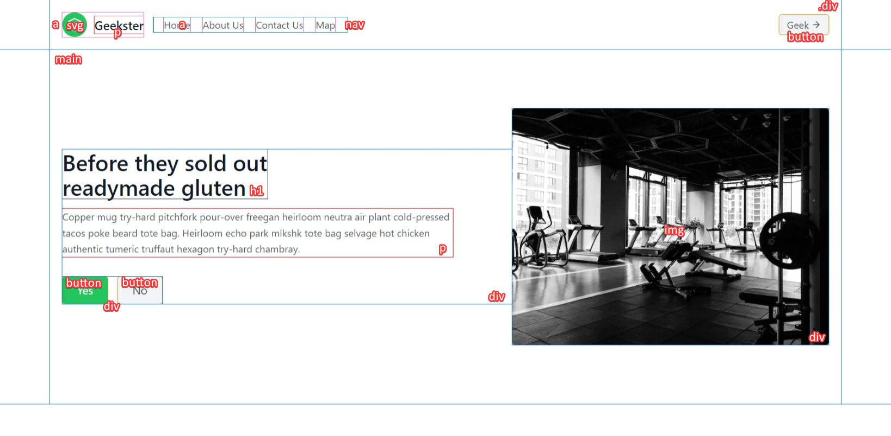
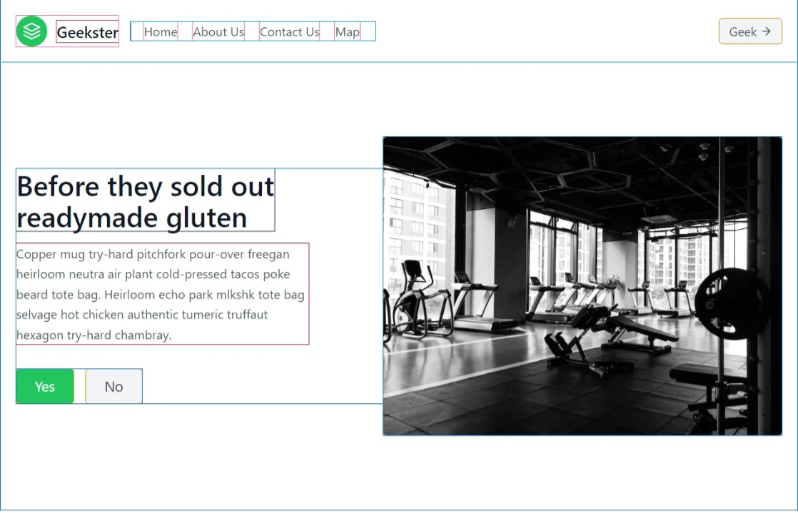

# Assignment

## [Live Website Link!](https://nirzon47.github.io/tailwind-responsive-assignment/)

### UI Structure

#### Web UI

#### Tablet UI

#### Phone UI

### Header

| Element/Class                                                                          | Description                                                                                                                                                        |
| -------------------------------------------------------------------------------------- | ------------------------------------------------------------------------------------------------------------------------------------------------------------------ |
| `<body class="text-gray-600">`                                                         | Sets the text color to gray.                                                                                                                                       |
| `<header>`                                                                             | Defines the header section of the webpage.                                                                                                                         |
| `
` | A container that centers its content vertically and horizontally. Uses flexbox for layout. Adds padding and changes the layout for medium-sized screens and above. |

Inside the header:

| Element/Class                                                                         | Description                                                                                                                                                                                                          |
| ------------------------------------------------------------------------------------- | -------------------------------------------------------------------------------------------------------------------------------------------------------------------------------------------------------------------- |
| `<a class="flex items-center mb-4 font-medium text-gray-900 cursor-pointer md:mb-0">` | Creates a link with flex layout, aligns items vertically, and adds margin at the bottom. Sets font weight to medium and text color to gray. For medium-sized screens and above, it removes the margin at the bottom. |
| `<svg ...>`                                                                           | SVG image with specific styles (size, padding, background color, rounded corners).                                                                                                                                   |
| `Geekster`                                          | Adds margin to the left of the text and sets the text size to extra-large.                                                                                                                                           |

Inside the navigation:

| Element/Class                                                                                                        | Description                                                                                                                                                                                                        |
| -------------------------------------------------------------------------------------------------------------------- | ------------------------------------------------------------------------------------------------------------------------------------------------------------------------------------------------------------------ |
| `<nav class="flex flex-wrap items-center justify-center md:mr-auto md:ml-4 md:pl-4 md:border-l md:border-gray-500">` | Creates a navigation menu with flex layout, aligning items vertically and horizontally. For medium-sized screens and above, it adds margin to the right, margin to the left, left border, and a gray border color. |
| `<a href="" class="mr-5 hover:text-gray-900">`                                                                       | Creates a navigation link with a margin to the right and a hover effect that changes the text color to gray.                                                                                                       |
| `<button class="flex items-center px-3 py-1 mt-4 bg-gray-100 rounded hover:bg-gray-200 md:mt-0">`                    | Creates a button with flex layout, aligns items vertically, adds padding, margin at the top, background color, and rounded corners. For medium-sized screens and above, it removes the margin at the top.          |

### Section

| Element/Class                                                                                   | Description                                                                                                                                                        |
| ----------------------------------------------------------------------------------------------- | ------------------------------------------------------------------------------------------------------------------------------------------------------------------ |
| `<section>`                                                                                     | Defines a section of the webpage.                                                                                                                                  |
| `
` | A container that centers its content vertically and horizontally. Uses flexbox for layout. Adds padding and changes the layout for medium-sized screens and above. |

Inside the left column:

| Element/Class                                                                                                                | Description                                                                                                                                                                                                                 |
| ---------------------------------------------------------------------------------------------------------------------------- | --------------------------------------------------------------------------------------------------------------------------------------------------------------------------------------------------------------------------- |
| `
` | A flex container with column layout, aligns items vertically and centers them horizontally. For medium-sized screens and above, it grows to fill available space, adds padding on the right, and aligns items to the start. |
| `<h1 class="mb-4 text-3xl font-medium text-gray-900 sm:text-4xl">`                                                           | Adds margin at the bottom, sets the text size to 3xl, font weight to medium, and text color to gray. For small screens and above, it increases the text size to 4xl.                                                        |
| `
`                                                                                           | Adds margin at the bottom and sets line height to relaxed.                                                                                                                                                                  |

Inside the button group:

| Element/Class                                                                                 | Description                                                                                                                                                               |
| --------------------------------------------------------------------------------------------- | ------------------------------------------------------------------------------------------------------------------------------------------------------------------------- |
| `<button class="px-6 py-2 text-lg text-white bg-green-500 rounded hover:bg-indigo-600">`      | Creates a button with padding, text size, white text color, green background color, and rounded corners. On hover, it changes the background color to indigo.             |
| `<button class="px-6 py-2 ml-4 text-lg text-gray-700 bg-gray-100 rounded hover:bg-gray-200">` | Creates another button with padding, text size, gray text color, gray background color, and rounded corners. On hover, it changes the background color to a lighter gray. |

Inside the right column:

| Element/Class                                                           | Description                                                                                                       |
| ----------------------------------------------------------------------- | ----------------------------------------------------------------------------------------------------------------- |
| `
`                    | Sets the width of the div for different screen sizes.                                                             |
| `` | Adds styles to the image, making it cover its container while keeping the aspect ratio, and rounding the corners. |
