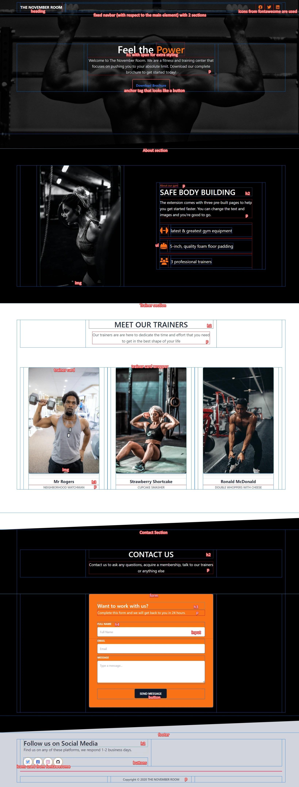

# Assignment

## [Live Website Link!](https://nirzon47.github.io/m3-majorproject-tw/)

### UI Structure

### The webpage is also responsive

### Animate on Scroll and TailwindCSS have been used

### Click on the links to navigate

- [Assignment](#assignment)
  - [Live Website Link!](#live-website-link)
    - [UI Structure](#ui-structure)
    - [The webpage is also responsive](#the-webpage-is-also-responsive)
    - [Animate on Scroll and TailwindCSS have been used](#animate-on-scroll-and-tailwindcss-have-been-used)
    - [Click on the links to navigate](#click-on-the-links-to-navigate)
    - [Body](#body)
    - [Navbar](#navbar)
    - [Landing Section](#landing-section)
    - [Angled Section](#angled-section)
    - [About Section](#about-section)
    - [Trainers Section](#trainers-section)
    - [Contact Header Section](#contact-header-section)
    - [Contact Form](#contact-form)
    - [Footer](#footer)
    - [Script for Animate on Scroll](#script-for-animate-on-scroll)

### Body

| Element/Class                              | Description                                                                |
| ------------------------------------------ | -------------------------------------------------------------------------- |
| `<body class="antialiased text-gray-800">` | Sets the body text color to gray-800 and applies antialiasing to the text. |

### Navbar

| Element/Class                                                                                                                                                                                                             | Description                                                                   |
| ------------------------------------------------------------------------------------------------------------------------------------------------------------------------------------------------------------------------- | ----------------------------------------------------------------------------- |
| `<nav class="absolute top-0 z-50 flex flex-wrap items-center justify-between w-full px-2 py-3 navbar-expand-lg">`                                                                                                         | Creates a fixed navbar at the top of the page with flex layout.               |
| `
`                                                                                                                                        | Contains the navbar content and centers it horizontally within the container. |
| Inside the navbar content div:                                                                                                                                                                                            |                                                                               |
| `<a class="inline-block py-2 mr-4 text-lg font-bold leading-relaxed text-white uppercase whitespace-no-wrap" href="https://www.creative-tim.com/learning-lab/tailwind-starter-kit###/presentation">The November Room</a>` | Creates a link with specific styling for the navbar title.                    |
| `<button class="block px-3 py-1 text-xl leading-none bg-transparent border border-transparent border-solid rounded outline-none cursor-pointer lg:hidden focus:outline-none">`                                            | Creates a button for mobile navigation with specific styling.                 |
| `<ul class="flex flex-col list-none lg:flex-row lg:ml-auto">`                                                                                                                                                             | Creates an unordered list for navigation links.                               |
| Inside each list item:                                                                                                                                                                                                    |                                                                               |
| `<li class="flex items-center">`                                                                                                                                                                                          | Creates a list item with flex layout for horizontal alignment.                |
| `<a class="flex items-center px-3 py-4 text-xs font-bold text-gray-800 uppercase lg:text-white lg:hover:text-gray-300 lg:py-2">`                                                                                          | Creates a link with specific styling for navigation items.                    |
| Inside each link:                                                                                                                                                                                                         |                                                                               |
| `<i class="text-lg text-orange-500 fab fa-facebook leading-lg"></i>`                                                                                                                                                      | Adds a Facebook icon with specific styling.                                   |
| `Share`                                                                                                                                                                  | Adds text for the mobile version of the link.                                 |

### Landing Section

| Element/Class                                                                                                                                                                                                                | Description                                                                  |
| ---------------------------------------------------------------------------------------------------------------------------------------------------------------------------------------------------------------------------- | ---------------------------------------------------------------------------- |
| `<main>`                                                                                                                                                                                                                     | Defines the main content section of the page.                                |
| `
`                                                                                                                            | Creates a container for the landing section with specific styling.           |
| Inside the container:                                                                                                                                                                                                        |                                                                              |
| `
`                                                                                                                                                           | Sets a background image that covers the entire container.                    |
| ``                                                                                                                                                           | Adds a semi-transparent black overlay over the background image.             |
| `
`                                                                                                                                                                | Contains the content of the landing section and applies a fade-in animation. |
| Inside the container:                                                                                                                                                                                                        |                                                                              |
| `
`                                                                                                                                                                                  | Creates a flex container for the content.                                    |
| Inside the flex container:                                                                                                                                                                                                   |                                                                              |
| `
`                                                                                                                                                            | Sets the width and text alignment for the content.                           |
| Inside this div:                                                                                                                                                                                                             |                                                                              |
| `<h1 class="text-5xl font-semibold text-white">`                                                                                                                                                                             | Defines a large, bold heading with white text color.                         |
| ``                                                                                                                                                                                             | Applies an orange text color to a specific part of the heading.              |
| `
`                                                                                                                                                                                     | Defines a paragraph with specific text size and gray text color.             |
| `<a href="###" class="inline-block p-4 mt-5 font-semibold text-blue-500 bg-transparent border border-orange-500 rounded cursor-pointer hover:bg-orange-500 hover:text-white hover:border-transparent">Download Brochure</a>` | Creates a styled download button with hover effects.                         |

### Angled Section

| Element/Class                                                                                                                                                    | Description                                                          |
| ---------------------------------------------------------------------------------------------------------------------------------------------------------------- | -------------------------------------------------------------------- |
| `
`                                                    | Adds an angled section divider at the bottom of the landing section. |
| Inside this div:                                                                                                                                                 |                                                                      |
| `<svg class="absolute bottom-0 overflow-hidden" xmlns="http://www.w3.org/2000/svg" preserveAspectRatio="none" version="1.1" viewBox="0 0 2560 100" x="0" y="0">` | Creates an SVG polygon for the angled section divider.               |

### About Section

| Element/Class                                                                        | Description                                                     |
| ------------------------------------------------------------------------------------ | --------------------------------------------------------------- |
| `<section id="about" class="relative py-20 text-white bg-black">`                    | Defines a section with a black background and white text color. |
| `
`                                               | Contains the content of the section and sets its maximum width. |
| Inside the container:                                                                |                                                                 |
| `
`                                          | Creates a flex container for the content.                       |
| Inside the flex container:                                                           |                                                                 |
| `
`  | Sets the width and applies a flip-left animation.               |
| Inside this div:                                                                     |                                                                 |
| `` | Adds an image with rounded corners and a shadow.                |
| `
`                                                     | Creates a container for the text content.                       |
| Inside this div:                                                                     |                                                                 |
| `<small class="text-orange-500">About our gym</small>`                               | Adds a small text with an orange color.                         |
| `<h3 class="text-4xl font-semibold uppercase">Safe body Building</h3>`               | Defines a large, bold heading with uppercase text.              |
| `
`                                           | Defines a paragraph with specific text size and line height.    |
| `<ul class="mt-6 list-none">`                                                        | Creates an unordered list for bullet points.                    |
| Inside each list item:                                                               |                                                                 |
| `<li class="py-2">`                                                                  | Sets padding for each list item.                                |
| Inside each list item:                                                               |                                                                 |
| `
`                                                    | Creates a flex container for each bullet point.                 |
| Inside each flex container:                                                          |                                                                 |
| `
`                                                                              | Creates a container for the icon.                               |
| Inside this div:                                                                     |                                                                 |
| ``                | Adds an orange-colored icon to the bullet point.                |
| Inside this div:                                                                     |                                                                 |
| `<i class="fas fa-dumbbell fa-2x"></i>`                                              | Defines a Font Awesome dumbbell icon.                           |
| `
`                                                                              | Creates a container for the text content.                       |
| Inside this div:                                                                     |                                                                 |
| `<h4 class="text-xl ">latest &amp; greatest gym equipment</h4>`                      | Defines a subheading for the bullet point.                      |

### Trainers Section

| Element/Class                                                                                                    | Description                                                                    |
| ---------------------------------------------------------------------------------------------------------------- | ------------------------------------------------------------------------------ |
| `<section class="pt-20 pb-48">`                                                                                  | Defines a section with specific padding.                                       |
| `
`                                                                           | Contains the content of the section and sets its maximum width.                |
| Inside the container:                                                                                            |                                                                                |
| `
`                                                  | Creates a flex container for the title and description.                        |
| Inside the flex container:                                                                                       |                                                                                |
| `
`                                                                            | Sets the width of the content.                                                 |
| Inside this div:                                                                                                 |                                                                                |
| `<h2 class="text-4xl font-semibold uppercase">Meet our Trainers</h2>`                                            | Defines a large, bold title with uppercase text.                               |
| `
`                                                          | Defines a paragraph with specific text size, line height, and gray text color. |
| `
`                                                                                   | Creates a flex container for trainer cards.                                    |
| Inside the flex container:                                                                                       |                                                                                |
| Each trainer card is created using a similar structure. Here, we'll explain the classes used for the first card: |
| `
`                               | Sets the width, margin, and applies a flip-right animation to the card.        |
| Inside this div:                                                                                                 |                                                                                |
| `
`                                                                                             | Creates a container for the card content.                                      |
| Inside this div:                                                                                                 |                                                                                |
| ``      | Adds an image with rounded corners and a shadow.                               |
| `
`                                                                                 | Creates a container for the text content.                                      |
| Inside this div:                                                                                                 |                                                                                |
| `<h5 class="text-xl font-bold">Mr Rogers</h5>`                                                                   | Defines a subheading with a bold font.                                         |
| `
Neighborhood Watchman
`                        | Defines additional information about the trainer.                              |

### Contact Header Section

| Element/Class                                                                 | Description                                                     |
| ----------------------------------------------------------------------------- | --------------------------------------------------------------- |
| `<section class="relative block pb-20 text-white bg-black">`                  | Defines a section with a black background and white text color. |
| Inside this section:                                                          |                                                                 |
| The content is similar to the "About Section" with different text and images. |

### Contact Form

| Element/Class                                                                                                                                                                                                                          | Description                                                                           |
| -------------------------------------------------------------------------------------------------------------------------------------------------------------------------------------------------------------------------------------- | ------------------------------------------------------------------------------------- |
| `<section class="relative block py-24 bg-black lg:pt-0">`                                                                                                                                                                              | Defines a section with a black background for the contact form.                       |
| Inside this section:                                                                                                                                                                                                                   |                                                                                       |
| `
`                                                                                                                                                                                                 | Contains the content of the section and sets its maximum width.                       |
| Inside the container:                                                                                                                                                                                                                  |                                                                                       |
| `
`                                                                                                                                                                         | Creates a flex container for the form.                                                |
| Inside the flex container:                                                                                                                                                                                                             |                                                                                       |
| `
`                                                                                                                                                                                                  | Sets the width of the form container.                                                 |
| Inside this div:                                                                                                                                                                                                                       |                                                                                       |
| `
`                                                                                              | Creates a form container with specific styling and applies a fade-up-right animation. |
| Inside this div:                                                                                                                                                                                                                       |                                                                                       |
| `
`                                                                                                                                                                 | Creates a container for the form content with specific styling.                       |
| Inside this div:                                                                                                                                                                                                                       |                                                                                       |
| `<h4 class="text-2xl font-semibold">Want to work with us?</h4>`                                                                                                                                                                        | Defines a title for the form.                                                         |
| `
`                                                                                                                                                                                                | Defines a paragraph with specific text size and line height.                          |
| Inside the form:                                                                                                                                                                                                                       |                                                                                       |
| `<label class="block mb-2 text-xs font-bold uppercase" for="full-name">Full Name</label>`                                                                                                                                              | Defines a label for the "Full Name" input field.                                      |
| `<input type="text" class="w-full px-3 py-3 text-sm placeholder-gray-400 bg-white rounded shadow focus:outline-none focus:shadow-outline" placeholder="Full Name" style="transition: all 0.15s ease 0s">`                              | Creates an input field for the full name with specific styling.                       |
| Similar elements and classes are used for the email and message fields.                                                                                                                                                                |
| `<button class="px-6 py-3 mb-1 mr-1 text-sm font-bold text-white uppercase bg-gray-900 rounded shadow outline-none active:bg-gray-700 hover:shadow-lg focus:outline-none" style="transition: all 0.15s ease 0s">Send Message</button>` | Creates a styled button for submitting the form with hover and active effects.        |

### Footer

| Element/Class                                                                                     | Description                                             |
| ------------------------------------------------------------------------------------------------- | ------------------------------------------------------- |
| `<footer class="relative pt-8 pb-6 bg-gray-300">`                                                 | Defines a footer section with a gray background.        |
| Inside this footer:                                                                               |                                                         |
| The footer content includes social media icons and copyright information.                         |
| Social media icons are styled with specific classes for each icon.                                |
| `
`                                                            | Contains the footer content and sets its maximum width. |
| Inside the container:                                                                             |                                                         |
| `
`                                                             | Adds a horizontal line with a gray border color.        |
| `
`                     | Creates a flex container for the copyright information. |
| Inside the flex container:                                                                        |                                                         |
| `
`                                         | Sets the width of the copyright text.                   |
| Inside this div:                                                                                  |                                                         |
| `
Copyright © 2020 THE NOVEMBER ROOM
` | Defines the copyright text with specific styling.       |

### Script for Animate on Scroll

| Element/Class                                                            | Description                                                                     |
| ------------------------------------------------------------------------ | ------------------------------------------------------------------------------- |
| `` | Includes the AOS (Animate on Scroll) JavaScript library.                        |
| `<script>`                                                               | Initializes AOS with specific settings, including animation delay and duration. |
